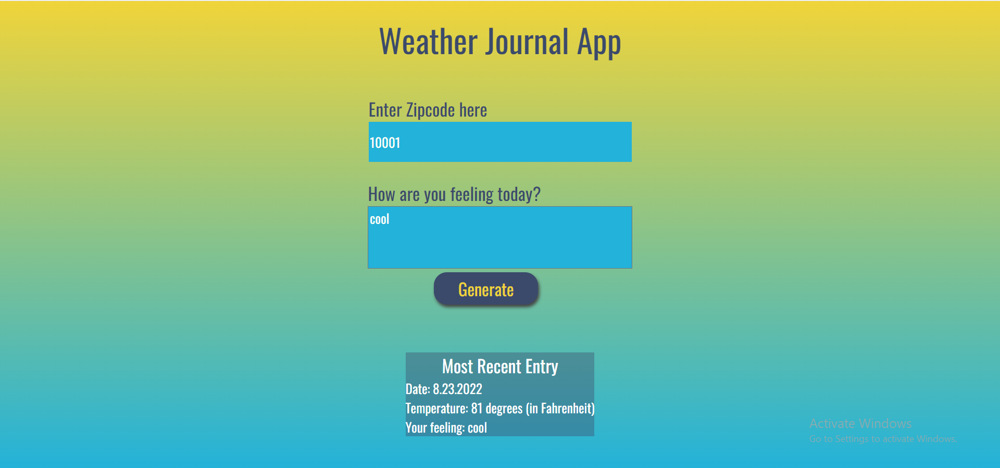
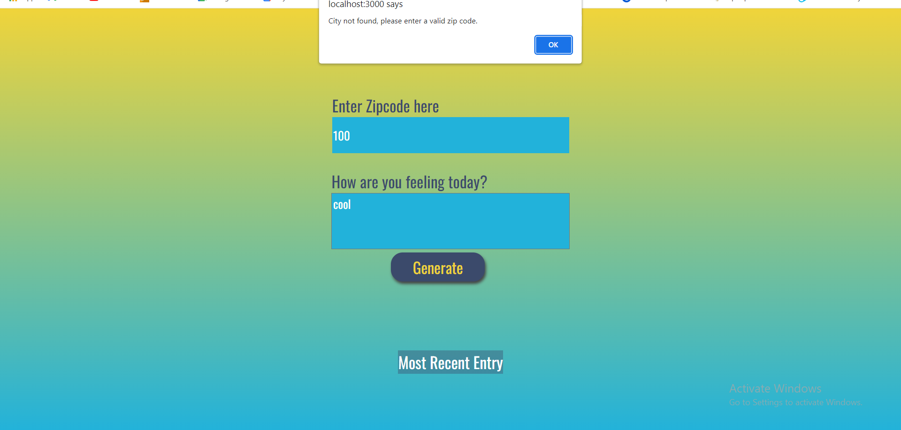
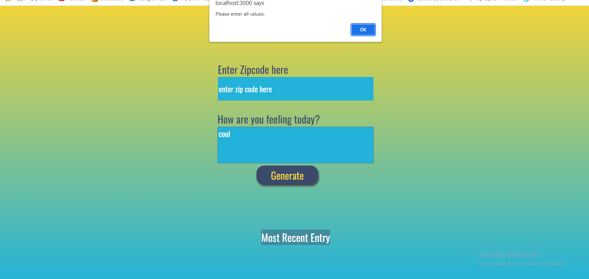

# Weather-Journal App Project

(Udacity & Egypt FWD Professional Front-End Web Development).

## Table of Contents

- [Project Title](#project-title)
- [Table of Contents](#project-title)
- [Installation & Usage](#installation-and-usage)
- [Development](#Development)
- [Description](#description)
- [Resources](#resources)
- [Acknowledgement](#acknowledgement)
- [Contribute](#contribute)
- [Screenshots](#screenshots)

## Installation & Usage

### To install:

- Download the zip file, then unzip it.
- download node.js https://nodejs.org/en/
- Setup it and set the environment variable.
- Go to the project folder, open the terminal and install the following dependencies (Express, body-parser, Cors).

  `npm install express`

  `npm install body-parser`

  `npm install cors`.

### How to get your personal API key:

Sign up to - https://openweathermap.org/api, your personal API key will be sebt to you be e-mail.

### How to run:

- Run the server

  `node server.js`.

- Go to browser and type

  `localhost:3000`.

## Development

Udacity's starter code is obtained with complete index.html, style.css files.

My work: writing server.js, app.js and modifying style.css.

### Languages & Dependencies

- HTML
- CSS
- JavaScript
- Node.js
- Express, body-parser, Cors

### Structure

- website
  - index.html
  - style.css
  - app.js
- server.js
- README.md

## Description

This project requires you to create an asynchronous web app that uses Web API and user data to dynamically update the UI for a Weather-Journal App.

You can enter a zip code of a city in USA and the app will show you the date and the temperature.

Summary:

In the callback function which is called as an event handler for the Generate button when it is clicked, a GET route is called to fetch the data from the API using the URL which contains the zipcode you enter.

Then a POST route is chained to add the data as an object contains {Date, Temperature, Feeling}.

Finally, a function to update the UI dynamically with the data is chained.

## Resources

Udacity's Web APIs and Asynchronous Applications course in Front-End development track.

## Acknowledgement

EgFWD online community.

## Contribute

The starter code is obtained from Udacity and developed by me "Hoda Gamal".

## Screenshots

